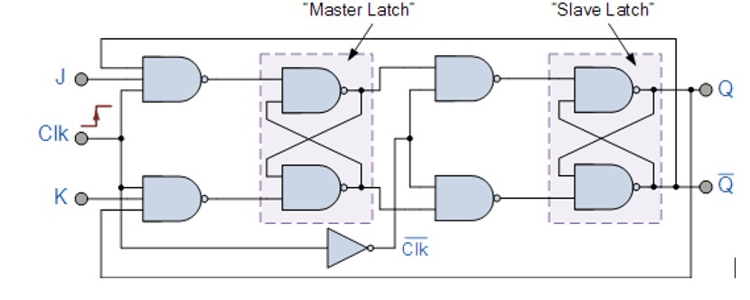
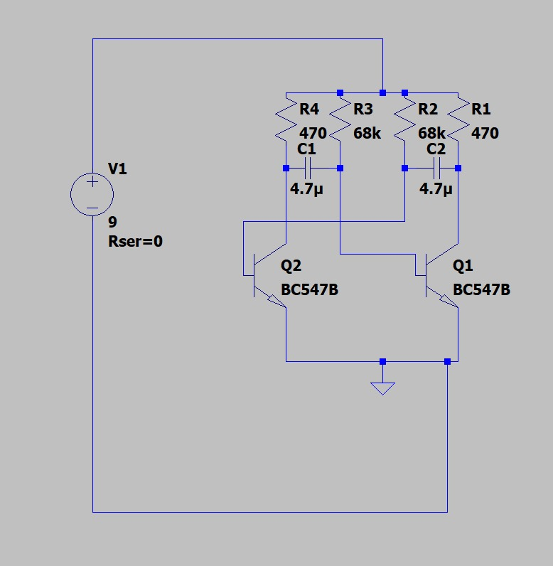
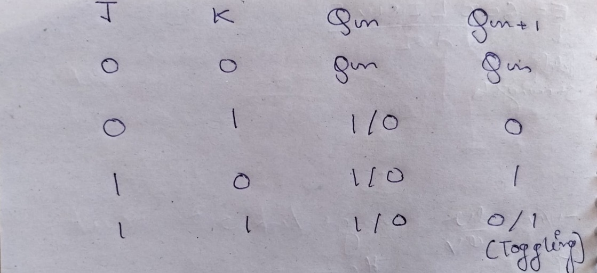
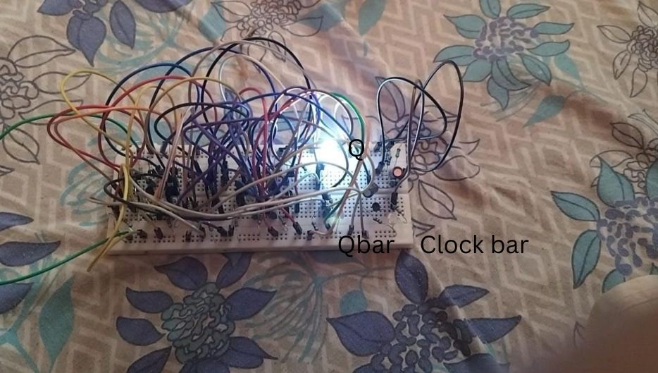
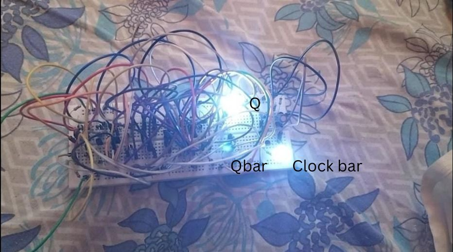
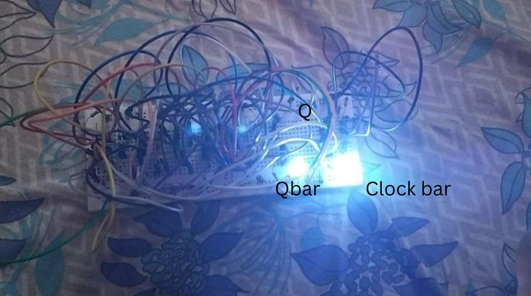
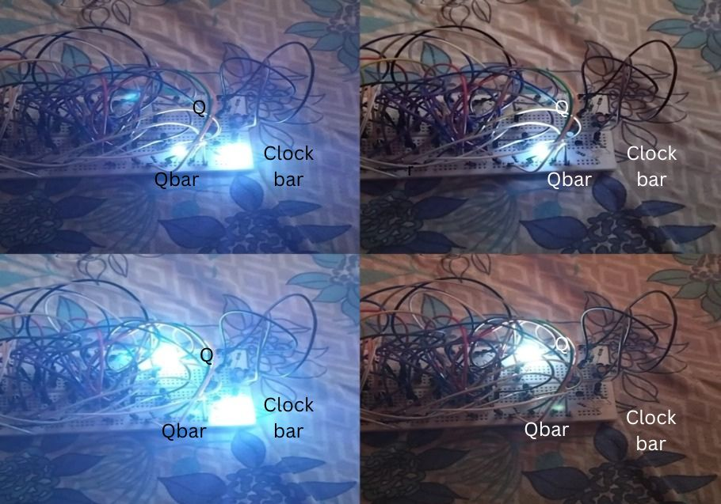

# Design and Implementation of a Discrete Transistor-Based Master–Slave J-K Flip-Flop with Astable Multivibrator

## Project Overview

This project involves the design and implementation of a master–slave J–K flip-flop using discrete transistors, resistors, and capacitors, without employing any Integrated Circuits (ICs). An astable multivibrator was designed and implemented to serve as the clock source.

The project aims to provide an understanding of sequential logic behavior at the hardware level, the limitations associated with such implementations, and the real-world hardware debugging challenges encountered during development.

---

## Technical Rationale and Architectural Significance

- The project does not utilize any Integrated Circuits; instead, the entire implementation is carried out at the discrete transistor level.
- The clock generation circuit was also assembled manually using discrete components.
- The race-around condition inherent to level-triggered J–K flip-flops was eliminated by adopting a master–slave configuration.
- Multiple debugging and rebuilding iterations were carried out to achieve reliable and successful operation.

---

## System Architecture

The system is organized into three primary functional blocks:

1. Clock Generation Unit  
2. Master Latch  
3. Slave Latch  

The overall architecture is designed to ensure controlled and deterministic state transitions while eliminating race-around behavior.

Figure 1 depicts the block-level circuit diagram of a master–slave J-K flip-flop.

An astable multivibrator generates a continuous square-wave clock signal using discrete transistors and resistor–capacitor (RC) timing components. The clock frequency is intentionally kept low to enable clear observation of internal state changes and to improve stability during testing and debugging.

Figure 2 gives the circuit diagram for an astable multivibrator.

---

### Master Latch Operation

The master latch receives the J and K inputs and is enabled during the active phase of the clock. During this phase, it samples the input conditions and stores the next state without affecting the output.

When the clock transitions to the complementary phase, the master latch becomes inactive, thereby isolating it from further input changes.

---

### Slave Latch Operation

The slave latch operates on the complementary clock phase. It remains disabled while the master latch is active and becomes enabled only after the master latch has captured a stable state.

The slave latch then transfers this stored state to the output terminals (Q and Q̄, complement of Q).

By ensuring that only one latch is active at any given time, the master–slave configuration prevents multiple toggles within a single clock cycle. This architecture guarantees that the output changes state only once per clock pulse, thereby eliminating the race-around condition inherent in level-triggered J-K flip-flops.

### Figure 1: Block level circuit diagram of a master–slave J-K flip-flop

### Figure 2: Circuit diagram of an astable multivibrator

---

## Key Design Decisions

A stable and clean square-wave signal was required to drive the state transitions, which was achieved using an astable multivibrator.

- A clock frequency of **2 Hz** was selected for the multivibrator.
- Due to the unavailability of exact capacitor values, the practical frequency shifted to approximately **2.3 Hz**.

The multivibrator frequency was deliberately kept low to:
- Allow visible observation of state changes
- Facilitate easier debugging
- Prevent errors or instability caused by propagation delays in Resistor–Transistor (RT) logic

The J–K flip-flop was implemented using a master–slave architecture because a conventional J–K flip-flop is level-triggered, whereas the master–slave configuration effectively provides edge-triggered behavior.

By employing opposite clock phases for the master and slave latches, the race-around condition is resolved, ensuring that the output changes state only once per clock cycle.

---

## Practical Challenges and Debugging

During the initial gate design phase, power efficiency was considered by selecting a large collector resistance:

- Collector resistance: **Rc = 100 kΩ**
- Base resistance: **Rb = 470 kΩ**

The intention was to reduce current flow when the gate output was low. However, when these gates were required to drive subsequent stages, a fan-out limitation was observed.

- The minimum required fan-out was **three**
- The output high voltage dropped to approximately **3.7 V** under a **9 V** supply

This voltage degradation reduced the base current of subsequent transistors, preventing them from operating in the saturation region and causing circuit failure.

To prioritize robustness and reliability over power efficiency:
- Rc was reduced to **2.2 kΩ**
- Rb was reduced to **12 kΩ**

With these values, sufficient base current was available even when driving multiple transistors, ensuring reliable saturation operation.

---

### Wiring Complexity

Another major challenge was the complexity of the wiring, which made analysis and debugging difficult. The densely interconnected circuit increased the likelihood of wiring errors, necessitating repeated reconstruction attempts.

To mitigate this issue, the design was implemented incrementally:
1. Master latch constructed and tested
2. Slave latch constructed and tested
3. Full system integration

This modular approach simplified debugging and enabled efficient fault isolation.

---

### Frequency Limitation

The circuit exhibited unreliable behavior at higher operating frequencies. This limitation is attributed to:
- The use of RTL
- Low resistance values employed to ensure transistor saturation

Both factors negatively affect switching speed.

Each issue required rebuilding and retesting, reinforcing the importance of signal integrity and timing in sequential circuits.

---

## Testing and Verification

The flip-flop operation was verified by applying all possible combinations of J and K inputs and observing the corresponding output transitions synchronized with the clock pulses.

The use of a low-frequency clock enabled clear observation of:
- Master latch sampling
- Subsequent slave latch output transitions

Figure 3 gives the truth table of the J-K flip-flop.  
Figures 4–7 depict the circuit operating in the states described in the truth table.

### Figure 3: Truth table of J-K flip-flop

### Figure 4: Stable state of Q = 1 when J = 0 and K = 0

### Figure 5: Stable state of Q = 1 when J = 1 and K = 0

### Figure 6: Stable state of Q = 0 when J = 0 and K = 1

### Figure 7: Toggling states when J = 1 and K = 1

---

### Observed States

- **Figure 4:** Circuit in an arbitrary stable state of Q = 1 when J = 0 and K = 0
- **Figure 5:** Circuit in stable state of Q = 1 when J = 1 and K = 0
- **Figure 6:** Circuit in stable state of Q = 0 when J = 0 and K = 1
- **Figure 7:** Toggling states of the flip-flop with clock when J = 1 and K = 1

---

## What This Project Demonstrates

- Understanding of sequential logic at transistor level
- Clocking and timing awareness
- Importance of simulation and calculations before implementing a design
- Hands-on debugging skills
- Component-level design trade-offs
- Patience and iteration in hardware development

---

## Limitations and Improvements

- This flip-flop may exhibit unreliable behavior at higher operating frequencies due to the use of high base currents for transistor switching and the inherent limitations of RTL.
- Since the circuit is implemented on a breadboard, it is sensitive to mechanical disturbances.
- Component tolerances may cause minor deviations between observed results and theoretical calculations.
- As a standalone unit, this flip-flop has limited direct application in practical systems.

### Future Extensions

- The design can be modified to function as a T flip-flop.
- Multiple flip-flops can be cascaded to form counters.
- Counters can be combined to implement registers.
- Implementing the design on a PCB would significantly reduce mechanical instability and improve overall circuit reliability.

---

## Conclusion

This project strengthened the understanding of timing-critical digital circuits and highlighted the gap between theoretical logic design and simulation tools and real-world hardware implementation.
